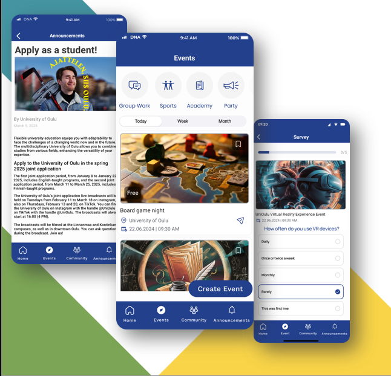

# WeConnect

## Description

**WeConnect** is a mobile application developed for the Information Processing Science (IPS) faculty at the University of Oulu. This app was created as part of an internship project under the supervision of the **INTERACT Research Group**.

The primary aim of this app is to enhance community engagement within the IPS faculty by offering a platform where students and faculty members can share posts, view announcements, and explore upcoming events.



### Key Features:
- **Community Posts**: A space where users can create and engage in posts, add comments, and participate in discussions.
- **Event Management**: Users can browse and explore upcoming events. The app displays the most recent 3 events prominently.
- **Announcements**: Faculty members can post important updates or news for the IPS community to stay informed.

This project is built using **Flutter** for the mobile frontend and **Appwrite** for backend services such as authentication, data storage, and real-time database interaction.

### Architecture


---

## Installation

To contribute to the **WeConnect**, follow these steps to set up the project locally on your machine. This guide will walk you through setting up the **Appwrite server** for backend services and **Flutter** for the mobile app.

### Prerequisites

Before you begin, make sure you have the following installed:

1. **Docker**: For running the Appwrite server.
2. **Flutter**: The mobile development framework.
3. **Git**: Version control to clone the repository.
4. **Visual Studio Code** or any preferred IDE.
5. **Python**: For running the database configuration script.

---

### 1. Install and Set Up Appwrite (Self-Hosted)

We are using a self-hosted **Appwrite** instance. Follow the steps below to set up **Appwrite** on your machine using Docker.

#### Docker Installation

1. **Docker CLI**: Make sure you have Docker installed on your machine. You can download it from [Docker's official site](https://www.docker.com/products/docker-desktop).

#### Run the Appwrite Server

Copy the appwrite env file from https://appwrite.io/install/env and place it in the appwrite folder.

If you do not want to use Docker Compose, the appwrite docs have a guide for other methods: https://appwrite.io/docs/advanced/self-hosting

After installing Docker, run the following command to start the Appwrite server:

```bash
docker compose -f ./appwrite/compose.yaml up -d
```
For detailed instructions, refer to the [Appwrite self-hosting documentation](https://appwrite.io/docs/advanced/self-hosting) or watch the [YouTube tutorial](https://youtu.be/aO4mw8smXkI?si=8qp5IWHNkY-74J5v).

## Setting up Appwrite

Once the server is up and running, you can access the Appwrite dashboard at `http://localhost` in your browser. You will be prompted to create an account and set up your project.

You need to register a new account, create a new organization, add a platform and create a new project. Once the project is created, you will need to create an API key that you will use to interact with the Appwrite API.

Adding a bucket through the Storage section is optional, but it is recommended for file storage. You can name the bucket anything you like, but make sure to update the `APPWRITE_BUCKET_ID` in your `.env` file accordingly.

### Creating an API Key

You can create an API key by following these steps:

1. Go to the Appwrite Overview dashboard.
2. Under "Integrate with your server" select "API key".
3. Select a name and an expiry date.
4. Select scopes; for development purposes, you can select all scopes.
5. Click "Create" to generate the API key.
6. Copy the API key and add it to your project's `.env` file.

### Adding a Platform

Appwrite requires you to add a platform to your project for CORS. You can add a platform by following these steps:

1. Go to the Appwrite Overview dashboard.
2. Under "Integrations" select "Add platform".
3. Select the platform type (e.g., Flutter app).
4. Select the correct platform and fill out the details (the package name should be the same as your Flutter app's package name. Current name is "community" and it is defined in pubspec.yaml).
5. Click through the optional steps and press "Go to dashboard".

### Enabling SMTP for password reset (optional)

If you want to enable password reset functionality, you need to set up SMTP settings in Appwrite. 

In the appwrite .env file, you should set the following variables:

```bash
_APP_SMTP_HOST=smtp.example.com
_APP_SMTP_PORT=587
_APP_SMTP_SECURE=tls
_APP_SMTP_USERNAME=example@mail.com
_APP_SMTP_PASSWORD=password
```

More information on SMTP settings can be found in the [Appwrite documentation](https://appwrite.io/docs/advanced/self-hosting/environment-variables#smtp).


You need to set the following environment variables in the `.env` file in the root of the project:

```bash
# Used by Flutter
# Your Appwrite server URL, default is http://localhost/v1
APPWRITE_URL=http://localhost/v1
# Your project ID
APPWRITE_PROJECT_ID=community-app
# Your API key
APPWRITE_API_KEY=xyz123 
APPWRITE_DATABASE_ID=communitydb # Default value
APPWRITE_BUCKET_ID=bucket # Name of the appwrite bucket for file storage
```

## Appwrite configuration with appwrite_init.py

To automate the Appwrite configuration process, we have provided a Python script (appwrite_init.py) that sets up the necessary collections and attributes in your Appwrite database.

Start with installing requirements:

```bash
pip install -r requirements.txt
```
Make sure you have filled the required fields in the .env file. Then run the script:

```bash
python appwrite_init.py
```

This script creates necessary collections and attributes for your Appwrite database, including collections like:

- **Events**
- **Topics**
- **Posts**
- **Comments**
- **Announcements**

For each collection, it defines the necessary attributes (e.g., title, content, datetime, etc.) and injects sample data to get you started.

What the Script Creates
- **Collections**: Events, Topics, Posts, Comments, Announcements.
- **Attributes**: For each collection, attributes like title, content, dateTime, authorName, and more are created.

For example, the Events collection will include attributes like:
- **title_en**
- **location_en**
- **date**
- **time**
- **posterPhotoUrl**

This setup ensures that your database is structured correctly for the application to work smoothly.

---
### 2. Install Flutter

Once Appwrite is set up, the next step is to install **Flutter** on your machine. Follow the official Flutter installation guide for your operating system:

- **Flutter Installation Guide**: [Get Started with Flutter](https://docs.flutter.dev/get-started/install)
- **YouTube Tutorial** for Windows: [Install Flutter on Windows](https://youtu.be/VFDbZk2xhO4?si=n3k9nqJ2sa8kIxi4)
- **YouTube Tutorial** for macOS: [Install Flutter on macOS](https://youtu.be/KdO9B_CZmzo?si=iYMvJ0ao_HHwKhfq)

#### Verify Installation

After installing Flutter, verify that Flutter and Dart have been installed successfully by running the following command in your terminal:

```bash
flutter doctor
```
This command will display any missing dependencies or issues that need to be resolved before proceeding. Make sure to resolve any issues if prompted.

---


### 3. Clone the Project


1. Open your terminal or command prompt.
2. Navigate to the directory where you want to store the project.
3. Run the following command to clone the repository:

```bash
git clone https://github.com/WalMaa/unioulu-ips-community-app.git
```

---

### 4. Set Up the Project

After cloning the project, follow these steps:

1. Navigate to the project directory:

```bash
cd unioulu-ips-community-app
```

2. Fetch all the dependencies required for the project by running:

```bash
flutter pub get
```

---

### 5. Run the Application

Now, you can run the Flutter app on your preferred device or emulator. Ensure your device is connected or the emulator is running, then use the following command:

```bash
flutter run
```

This will build and launch the app on the connected device or emulator.

---

For further assistance with running or debugging the project, please refer to the official Flutter documentation or check the project's issue tracker on GitHub.

---
## 3. Project Structure

This project follows CLEAN architecture principles combined with BLoC state management to maintain separation of concerns and keep the code modular, scalable, and testable. Here’s an overview of the folder structure:
```bash
lib/
│
├── core/                       # Core functionalities shared across the app
│   ├── fonts/                  # Font files for the app
│   ├── pages/                  # Core pages (e.g., splash screen)
│   ├── services/               # Services like dependency injection
│   ├── theme/                  # Theme-related files
│   └── utils/                  # Utility classes (e.g., responsive design)
│
├── features/                   # Feature-specific code
│   ├── auth/                   # Authentication feature
│   │   ├── data/               # Data layer for authentication
│   │   │   ├── datasources/    # Data sources (remote, local)
│   │   │   ├── models/         # Data models
│   │   │   └── repositories/   # Repository implementations
│   │   ├── domain/             # Domain layer for authentication
│   │   │   ├── entities/       # Core entities (e.g., User)
│   │   │   ├── repositories/   # Repository interfaces
│   │   │   └── usecases/       # Use cases (business logic)
│   │   └── presentation/       # Presentation layer for authentication
│   │       ├── bloc/           # BLoC for authentication
│   │       ├── pages/          # UI pages (e.g., login, register)
│   │       └── widgets/        # Smaller UI components (e.g., forms)
│   │
│   ├── community/              # Community feature (similar structure as auth)
│   ├── events/                 # Events feature (similar structure as auth)
│   ├── home/                   # Home feature (similar structure as auth)
│   ├── language/               # Language feature for localization
│   └── theme/                  # Theme feature for theming
│
├── l10n/                       # Localization files
│   ├── intl_en.arb             # English localization
│   ├── intl_fi.arb             # Finnish localization
│   ├── intl_sv.arb             # Swedish localization
│
└── main.dart                   # Application entry point
```

---

## 4. Features

This application includes the following features:

#### 1. Community Posts:
Users can add, view, and interact with community posts. The app allows users to post content, comment, and engage with the community.

#### 2. Announcements:
Users can view and add important announcements. These announcements are displayed prominently and can be updated regularly.

#### 3. Event Management:
The app features an event management section where users can view and manage events. The latest 3 events are displayed in a horizontal list format, allowing for quick access to upcoming activities.

#### 4. Language Support:
The app supports multiple languages, including English, Finnish, and Swedish. Users can switch between languages seamlessly.

#### 5. Like and Comment System:
Users can like and comment on posts, fostering interaction and engagement within the community.

#### 6. Event surveys:
Event surveys are available for users to provide feedback on events they attended. This feature helps in gathering insights and improving future events.

#### 7. Community post polls:
Community post polls allow users to create polls within posts, enabling community members to vote and express their opinions on various topics.

#### Appwrite Integration:
Appwrite is used for backend services such as data storage, user authentication, and API calls. The data for community posts, announcements, and events are securely stored and managed through Appwrite’s database service.

## 5. Contributing

We welcome contributions from the community! To contribute:

1. Fork the repository to your own GitHub account.
2. Create a new branch for your feature or bug fix:
```bash   
git checkout -b feature-or-bug-name
```
3. Once your changes are complete, commit and push your code:
```bash   
git commit -m "Add new feature or fix a bug"
```
```bash
git push origin feature-or-bug-name
```
4. Submit a pull request to the main repository for review.

### Coding Standards:
- Follow the Dart Style Guide and use meaningful naming conventions for variables and methods.
- Make sure to add documentation and comments where necessary.

## 6. License (Open Source)

This project is licensed under the MIT License.  
For more details, please refer to the LICENSE file.

## 7. Design

The Design documentation for the app can be found in the `design` folder of the repository. It contains all of the Figma design and planning documents related to the app as well as the picture assets.


## 8. Product Roadmap

The product roadmap outlines the future features and improvements planned for the app. It includes ideated of upcoming releases, feature enhancements, and bug fixes.

